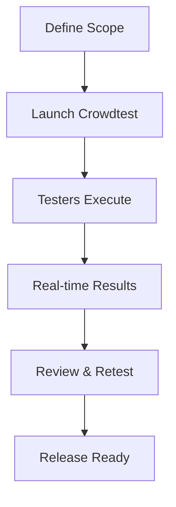

## Overview

Test IO provides opinionated, fully managed software testing and QA services tailored for agile teams. You gain access to a diverse community of over 400k testers, advanced quality engineering, and real-time insights to deliver exceptional product experiences. Key offerings include crowdtesting workflows, managed QA services, real-time reporting, and customizable testing cycles.

<Columns cols={3}>
  <Card title="Crowdtesting Workflows" icon="users" href="#crowdtesting">
    Leverage a global tester network for rapid, comprehensive testing.
  </Card>
  <Card title="Managed QA Services" icon="shield" href="#managed-qa">
    Fully managed services with expert oversight for complex projects.
  </Card>
  <Card title="Real-time Reporting" icon="bar-chart-3" href="#reporting">
    Instant analytics and dashboards to track testing progress.
  </Card>
</Columns>

<Columns cols={2}>
  <Card title="Customizable Cycles" icon="settings" href="#cycles">
    Tailor testing phases to fit your agile sprints.
  </Card>
</Columns>

## Crowdtesting Workflows

Crowdtesting enables you to distribute tests across a vast, skilled tester community. You define test cases, and Test IO matches them with qualified testers worldwide for exploratory and scripted testing.

<Steps>
  <Step title="Define Test Scope" icon="edit-3">
    Specify platforms, devices, and scenarios in your dashboard.
  </Step>
  <Step title="Launch Crowdtest" icon="zap">
    Activate the cycle; testers start immediately.
  </Step>
  <Step title="Review Results" icon="check-circle">
    Access bugs, screenshots, and videos in real time.
  </Step>
  <Step title="Resolve & Retest" icon="refresh-cw">
    Assign fixes and run verification cycles.
  </Step>
</Steps>



## Managed QA Services

Choose from tiers of managed services where Test IO experts handle planning, execution, and reporting.

<Tabs>
  <Tab title="Basic" icon="circle">
    Automated crowdtesting with light oversight.
  </Tab>
  <Tab title="Professional" icon="award">
    Dedicated test managers for strategy and execution.
  </Tab>
  <Tab title="Enterprise" icon="globe">
    Full QA integration with EPAM engineering support.
  </Tab>
</Tabs>

<Callout kind="tip">
  Start with Professional for agile teams needing consistent quality without building internal QA teams.
</Callout>

## Real-time Reporting and Analytics

Monitor testing in real time via dashboards and APIs. Integrate with your CI/CD pipeline for automated insights.

<CodeGroup tabs="JavaScript,Python">
  ```javascript
  const response = await fetch('https://api.example.com/v1/tests/123/reports', {
    headers: {
      'Authorization': 'Bearer YOUR_TOKEN',
      'Content-Type': 'application/json'
    }
  });
  const data = await response.json();
  console.log(data.bugsFound); // e.g., 42
  ```
  ```python
  import requests
  response = requests.get(
    'https://api.example.com/v1/tests/123/reports',
    headers={'Authorization': 'Bearer YOUR_TOKEN'}
  )
  data = response.json()
  print(data['bugsFound'])  # e.g., 42
  ```
</CodeGroup>

<ResponseField name="bugsFound" field-type="integer" required="true">
  Total bugs detected in the cycle.
</ResponseField>

<ResponseField name="coverage" field-type="object">
  Device and OS coverage stats.
</ResponseField>

## Customizable Testing Cycles

Adapt cycles to your sprint length and risk profile. Use exploratory testing for new features or regression suites for stability.

<Expandable title="Advanced Cycle Configuration" default-open="false">

Configure via API or dashboard:

<ParamField path="cycleType" param-type="string" required="true">
  Options: `exploratory`, `regression`, `smoke`.
</ParamField>

<ParamField query="durationHours" param-type="integer">
  Cycle length in hours (default: 48).
</ParamField>

Example payload:

```json
{
  "cycleType": "exploratory",
  "durationHours": 24,
  "platforms": ["android", "ios"]
}
```

</Expandable>

<Callout kind="success">
  Combine features for end-to-end QA: Launch crowdtesting, add managed oversight, track via APIs, and iterate cycles.
</Callout>