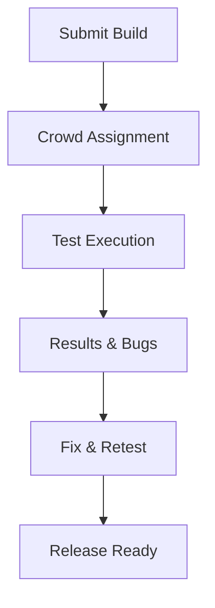

## Overview

Test IO delivers opinionated, fully managed software testing and QA services tailored for agile teams. With over a decade of experience, you gain access to a diverse community of more than `400k` testers who ensure exceptional product experiences for global brands. As part of EPAM, a NYSE-listed company, Test IO combines crowdtesting with advanced quality engineering to help you ship reliable software faster.

## Key Features

Test IO stands out with powerful features that streamline your QA process.

<Columns cols={3}>
  <Card title="Crowdtesting" icon="users" href="#crowdtesting">
    Tap into a global pool of `400k+` expert testers for real-world testing across devices and regions.
  </Card>
  <Card title="Managed QA" icon="shield" href="#managed-qa">
    Fully managed services handle test planning, execution, and reporting so you focus on development.
  </Card>
  <Card title="EPAM Integration" icon="link" href="#epam">
    Leverage EPAM's quality engineering expertise for scalable, enterprise-grade testing solutions.
  </Card>
</Columns>

## Benefits for Agile Teams

You benefit from rapid testing cycles that align with agile sprints, reducing defects by up to `50%` and accelerating time-to-market. Global brands trust Test IO for comprehensive coverage, while the managed approach eliminates the need for in-house QA teams. Integration with EPAM enhances capabilities in AI-driven testing and professional services, ensuring compliance and performance at scale.

<Callout kind="success">
  Teams using Test IO report `30%` faster release cycles and higher customer satisfaction scores.
</Callout>

## Quick Start

Get up and running with Test IO in minutes.

<Steps>
  <Step title="Sign Up" icon="user-plus">
    Create your account at `https://dashboard.testio.com/signup` and verify your email.
  </Step>
  <Step title="Create Project" icon="plus">
    Set up a new testing project, define your app details, and select testing types like functional or exploratory.
  </Step>
  <Step title="Launch Tests" icon="zap">
    Submit your build and watch as the crowd executes tests. View real-time results in the dashboard.
  </Step>
  <Step title="Integrate API" icon="code">
    Use the Test IO API to automate reporting.

````jsx
<CodeGroup tabs="JavaScript,Python">
```javascript
const response = await fetch('https://api.example.com/v1/tests', {
  method: 'POST',
  headers: { 'Authorization': `Bearer ${YOUR_API_KEY}` },
  body: JSON.stringify({ projectId: 'proj_123', type: 'functional' })
});
```
```python
import requests
response = requests.post('https://api.example.com/v1/tests',
  headers={'Authorization': f'Bearer {YOUR_API_KEY}'},
  json={'projectId': 'proj_123', 'type': 'functional'})
```
</CodeGroup>
````
  </Step>
</Steps>

## Testing Workflow



## Next Steps

<Columns cols={2}>
  <Card title="Quickstart Guide" icon="book-open" href="/quickstart">
    Dive into detailed setup and your first test cycle.
  </Card>
  <Card title="Authentication" icon="lock" href="/authentication">
    Secure your API access and manage tokens.
  </Card>
</Columns>

<Expandable title="Explore Advanced Features" default-open="false">
  Dive deeper into custom test cycles, performance testing, and EPAM's AI tools for predictive QA.
</Expandable>